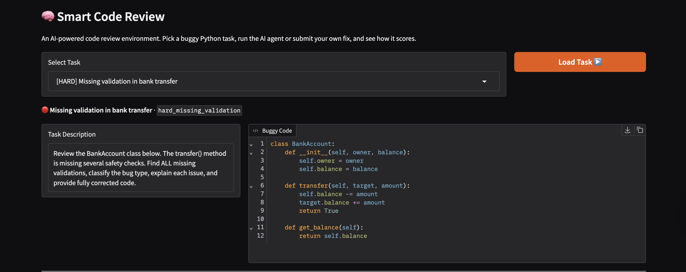
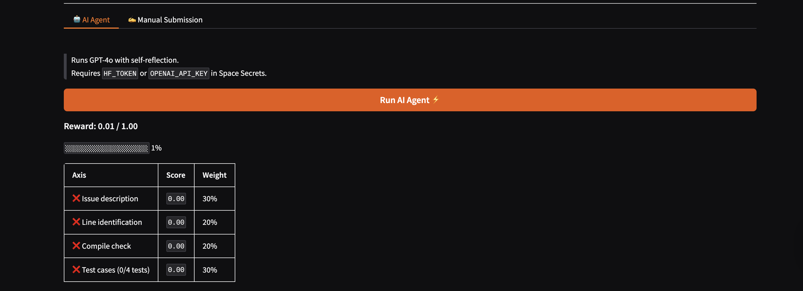

# 🔥 Smart Code Review — OpenEnv

### What if every pull request had a senior engineer reviewing it — instantly?

> An AI-powered code review environment built for the **Meta OpenEnv Hackathon**.
> Agents don't just find bugs — they *trace execution*, *classify issues*, and *generate verified fixes* — all under time pressure.

---

## 🎯 Live Demo

👉 **[Try it live on Hugging Face Spaces](https://huggingface.co/spaces/Beastchaitanya/smart-code-Review2)**

Paste any buggy Python function → get instant bug detection, explanation, and a working fix.

---

## 💡 Why This Matters

Code review is the biggest bottleneck in software development. Developers spend **6+ hours per week** reviewing code, and subtle logical bugs slip through at alarming rates.

Existing tools fall short:

| Tool | Catches | Misses |
|------|---------|--------|
| **Linters** (pylint, flake8) | Style violations, unused imports | Logic errors, wrong algorithms |
| **Type checkers** (mypy) | Type mismatches | Correct types, wrong logic |
| **Static analysis** (Semgrep) | Known vulnerability patterns | Novel bugs, domain logic |
| **Smart Code Review AI** | **All of the above + logical bugs, off-by-one errors, edge cases, semantic mistakes** | — |

**Smart Code Review** doesn't just parse code — it **traces execution with concrete inputs** to find bugs that only surface at runtime.

---

## Overview

**Smart Code Review OpenEnv** turns code review into a structured reinforcement learning task. An AI agent is shown buggy Python code, must identify the bug, classify it, and submit a working fix — all within a step budget. The environment rewards fast, accurate, well-reasoned fixes and penalises slow or incorrect ones.

This simulates real-world debugging workflows where agents iteratively analyze, validate, and refine fixes under constraints — making it a natural fit for evaluating and training LLM-based agents on software engineering tasks.

---

## Key Features

### 1. Multi-Dimension Scoring
No binary pass/fail. Each submission is graded across **4 weighted axes**:

| Axis | Weight | What It Measures |
|------|--------|-----------------|
| Issue description | 30% | Correct bug type identified? |
| Line identification | 20% | Right line flagged (±1 tolerance)? |
| Compile check | 20% | Fixed code runs without errors? |
| Test cases | 30% | Fix produces correct outputs? |

Smooth partial rewards (0.25, 0.50, 0.75) give agents a real gradient to learn from.

### 2. Time-Pressure Penalty
Decisive agents are rewarded. Every step beyond the free allowance costs `-0.05`:

| Difficulty | Free Steps |
|-----------|-----------|
| Easy | 2 |
| Medium | 3 |
| Hard | 4 |

### 3. Code Execution Verifier
The fix is **actually run** via `subprocess` in an isolated temp file with a 5-second timeout. No string-matching — the code must execute and produce correct output.

### 4. Multi-Turn Debugging Protocol
`step()` supports three action types for realistic debugging:

| Action | Effect |
|--------|--------|
| `"hint"` | Returns bug type as a hint (costs 1 step) |
| `"run_test"` | Runs one test case against current fix (costs 1 step) |
| `"submit"` | Grades the full submission and ends the episode |

Agents can probe the environment before committing — at the cost of step budget.

### 5. Self-Reflection Loop
The LLM agent makes **two passes** per review:

1. **Initial analysis** — generates `bug_line`, `issues`, and `fix`
2. **Reflection pass** — verifies the fix, checks edge cases, improves if needed

If reflection fails, the initial answer is used as a safe fallback.

### 6. Adversarial Fix Detection
The grader catches gaming attempts:

- **Static checks** — flags empty fixes, unchanged code, hardcoded returns (`return 0`, `return True`)
- **Dynamic checks** — runs adversarial tests to catch constant-value outputs
- **Penalty** — suspicious fixes receive `-0.3` before clamping

### 7. Leaderboard & Consistency Tracking
Every `step()` is recorded. `env.leaderboard()` prints a summary:

```
TASK                      AVG     MIN     MAX     PENALTY     CONSISTENCY
--------------------------------------------------------------------------
easy_off_by_one           0.85    0.72    0.99    0.05        0.91
medium_mutable_default    0.95    0.95    0.95    0.00        0.99
hard_missing_validation   0.60    0.40    0.80    0.15        0.75
```

Consistency = `1 − std_dev(rewards)` — stable agents beat lucky ones.

---

## 🏗️ Architecture

```
┌─────────────────────────────────────────────────┐
│                   Gradio UI                      │
│         (paste code → get review)                │
└──────────────────┬──────────────────────────────┘
                   │
                   ▼
┌─────────────────────────────────────────────────┐
│              inference.py                        │
│  ┌───────────┐    ┌──────────────┐              │
│  │ _call_llm │───▶│ _reflect     │  Chain-of-   │
│  │ (initial) │    │ (verify)     │  thought +    │
│  └───────────┘    └──────────────┘  self-review  │
└──────────────────┬──────────────────────────────┘
                   │
                   ▼
┌─────────────────────────────────────────────────┐
│           OpenEnv Environment                    │
│  ┌────────────┐ ┌─────────────┐ ┌────────────┐ │
│  │  Grader    │ │   Code      │ │   Time     │ │
│  │  (4-axis)  │ │  Verifier   │ │  Penalty   │ │
│  └────────────┘ └─────────────┘ └────────────┘ │
└─────────────────────────────────────────────────┘
```

---

## Tasks

### 🟢 Easy — Off-by-one Error
```python
def sum_list(numbers):
    total = 0
    for i in range(1, len(numbers)):   # Bug: skips index 0
        total += numbers[i]
    return total
```
**Bug type:** `off-by-one` · **Bug line:** 3

### 🟡 Medium — Mutable Default Argument
```python
def add_item(item, item_list=[]):   # Bug: shared across all calls
    item_list.append(item)
    return item_list
```
**Bug type:** `mutable-default-argument` · **Bug line:** 1

### 🔴 Hard — Missing Validation in Bank Transfer
```python
class BankAccount:
    def __init__(self, owner, balance):
        self.owner = owner
        self.balance = balance

    def transfer(self, target, amount):
        self.balance -= amount     # Bug: no validation at all
        target.balance += amount
        return True
```
**Bug type:** `missing-validation` · **Bug line:** 7
**Expected issues:** No check for negative/zero amount · No check for insufficient funds · No check for self-transfer

---

## Reward Function

```
base_score   =  0.3 × issue + 0.2 × line + 0.2 × compile + 0.3 × test
final_score  =  0.85 × base_score + 0.15 × reasoning_score
penalty      =  max(0, steps_taken − allowed) × 0.05
final_reward =  clamp(final_score − penalty, 0.01, 0.99)
```

### Baseline Scores

| Task | Score |
|------|-------|
| `easy_off_by_one` | ~0.70 |
| `medium_mutable_default` | ~0.95 |
| `hard_missing_validation` | ~0.50 – 0.70 |

---

## OpenEnv Compliance

Fully implements the OpenEnv standard with typed Pydantic models:

| Method | Description |
|--------|-------------|
| `reset(task_id?)` | Loads task, resets counter, returns observation |
| `step(action)` | Grades submission, applies penalty, returns result |
| `state()` | Returns current environment state at any point |

### Observation (from `reset()`)
```python
{"task_id": str, "difficulty": str, "buggy_code": str, "description": str}
```

### Action (to `step()`)
```python
{"bug_line": int, "issues": [str], "fix": str}
```

### Result (from `step()`)
```python
{"state": dict, "reward": float, "done": bool}
```

---

## Project Structure

```
smart-code-review/
├── app.py              # FastAPI + Gradio web interface
├── environment.py      # OpenEnv class: reset(), step(), state()
├── tasks.py            # 3 tasks (easy / medium / hard) with test cases
├── grader.py           # 4-axis weighted scorer
├── codeverifier.py     # subprocess-based code runner and test checker
├── timepenalty.py      # step-count penalty with difficulty thresholds
├── inference.py        # LLM agent with self-reflection
├── server/
│   ├── app.py          # Required by OpenEnv multi-mode deployment validator
│   └── __init__.py
├── openenv.yaml        # OpenEnv spec definition
├── pyproject.toml      # Package config with openenv-core>=0.2.0
├── uv.lock             # Dependency lock file
├── requirements.txt
├── Dockerfile
└── README.md
```

---

## Tech Stack

| Layer | Technology |
|-------|-----------|
| Language | Python 3.11+ |
| LLM Agent | OpenAI-compatible API (via OpenEnv proxy) |
| Code Execution | `subprocess` + `tempfile` (sandboxed, 5s timeout) |
| Models | Pydantic v2 |
| Frontend | Gradio |
| Deployment | Docker + Hugging Face Spaces |

---

## How to Run

```bash
# Install
pip install -r requirements.txt

# Set credentials
export API_KEY=your-openenv-key          # injected by OpenEnv validator
export API_BASE_URL=your-openenv-url     # injected by OpenEnv validator
export MODEL_NAME=gpt-4o                 # optional, default: gpt-4o

# For local use only (not needed for validator)
export OPENAI_API_KEY=your-key-here

# Run the agent (all 3 tasks)
python inference.py

# Run a specific task
python inference.py easy_off_by_one

# Run the Gradio UI
python app.py
```

### Docker
```bash
docker build -t smart-code-review .
docker run -e API_KEY=your-key -e API_BASE_URL=your-url -p 7860:7860 smart-code-review
```

### Hugging Face Spaces
1. Push repo to your HF account
2. Set `API_KEY`, `API_BASE_URL`, and `MODEL_NAME` in Space Secrets
3. Space launches automatically

---

## Why This Project Stands Out

- **Deterministic grading** — no LLM-as-judge. Code either runs and passes tests, or it doesn't.
- **Partial rewards** — smooth 4-axis scoring gives agents a real learning gradient, not just 0 or 1.
- **Temporal realism** — every `step()` counts. Time penalty makes decisive agents win.
- **Real execution** — subprocess sandboxing with timeout. No fake scoring.
- **Adversarial robustness** — catches gaming attempts with static + dynamic checks.
- **Self-reflection** — two-pass LLM review catches mistakes the first pass misses.
- **Production patterns** — sandboxing, cleanup, timeouts, safe defaults throughout.
- **OpenEnv compliant** — passes all Phase 1 automated checks including multi-mode deployment validation.

---

## 🔮 Future Scope

- **Multi-language support** — JavaScript, Java, Go, Rust
- **Multi-file analysis** — review entire repositories
- **Git integration** — plug into GitHub/GitLab PR workflows
- **VS Code extension** — real-time bug detection as you type
- **Expanded task bank** — 100+ tasks for comprehensive evaluation

---

## 📸 Screenshots

### 🧠 Smart Code Review UI


### 📊 Leaderboard & Consistency


---

*Code review shouldn't be a bottleneck. It should be instant, accurate, and always available.*

*Built for the Meta OpenEnv Hackathon.*